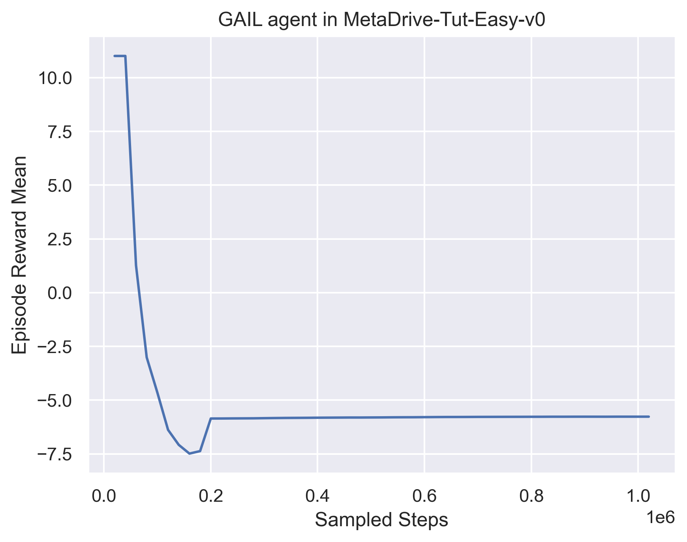

# Assignment 3 of CS269 2022 Fall

**NAME:** Arjun Aggarwal

**UID:** 806297859

## Learning curves of TD3

### TD3 in Pendulum-v1

(10 points)

### TD3 in MetaDrive-Tut-Hard-v0

(20 points)

## Learning curves of PPO

### PPO in CartPole-v1

10 points

### PPO in MetaDrive-Tut-Hard-v0

10 points

## Learning curves of GAIL

### GAIL in MetaDrive-Tut-Easy-v0

(20 points)

## Generalization Experiment

In this section, you need to draw one figure
whose X-coordinate represents "the number of training scenes" and 
Y-coordinate represents "the episodic reward".

We expect two lines in the figure, showing the final training performance and 
the test performance varying with the number of training scenes. 

You can refer to the Figure 8 of the paper of  [MetaDrive paper](https://arxiv.org/pdf/2109.12674.pdf) 
to see the expected curves. [ProcGen paper](http://proceedings.mlr.press/v97/cobbe19a/cobbe19a.pdf) is also highly relevant.

Choosing one algorithm, you should train agents in `MetaDrive-Tut-[1,5,10,20,50,100]Env-v0` environments and test all agents in `MetaDrive-Tut-Test-v0`.

### The generalization curves

(30 points)

[TODO]: Discuss the figure. Does it look normal? If not, why? Do you have any solution?

