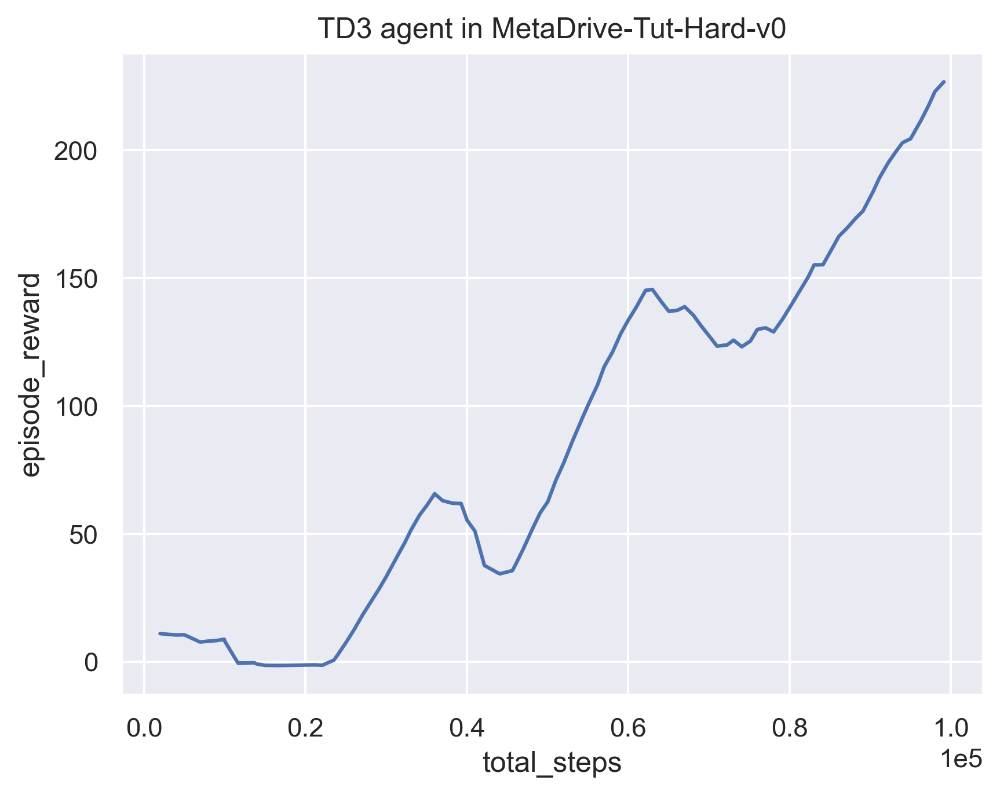

# Assignment 3 of CS269 2022 Fall

**NAME:** Arjun Aggarwal

**UID:** 806297859

## Learning curves of TD3

### TD3 in Pendulum-v1

(10 points)

### TD3 in MetaDrive-Tut-Hard-v0

(20 points)

## Learning curves of PPO

### PPO in CartPole-v1

10 points

### PPO in MetaDrive-Tut-Hard-v0

10 points

## Generalization Experiment

In this section, you need to draw one figure
whose X-coordinate represents "the number of training scenes" and 
Y-coordinate represents "the episodic reward".

We expect two lines in the figure, showing the final training performance and 
the test performance varying with the number of training scenes. 

You can refer to the Figure 8 of the paper of  [MetaDrive paper](https://arxiv.org/pdf/2109.12674.pdf) 
to see the expected curves. [ProcGen paper](http://proceedings.mlr.press/v97/cobbe19a/cobbe19a.pdf) is also highly relevant.

Choosing one algorithm, you should train agents in `MetaDrive-Tut-[1,5,10,20,50,100]Env-v0` environments and test all agents in `MetaDrive-Tut-Test-v0`.

### The generalization curves

(30 points)

### Obervation:
- The graph indicates that the agent's performance peaks during training but drops when facing new test scenarios.

### Analysis:
- The agent seems to have specialized in its training environment at the cost of generalizing to new situations. I think that there has not been adequate variation in the training.

### Conclusion:
- For better generalization, we can introduce a wider range of scenarios during training. This suggests that if the agent is trained with a more diverse set of scenarios, it is likely to perform better in new environments. It highlights the need for varied training experiences to develop a more adaptable and robust agent.

